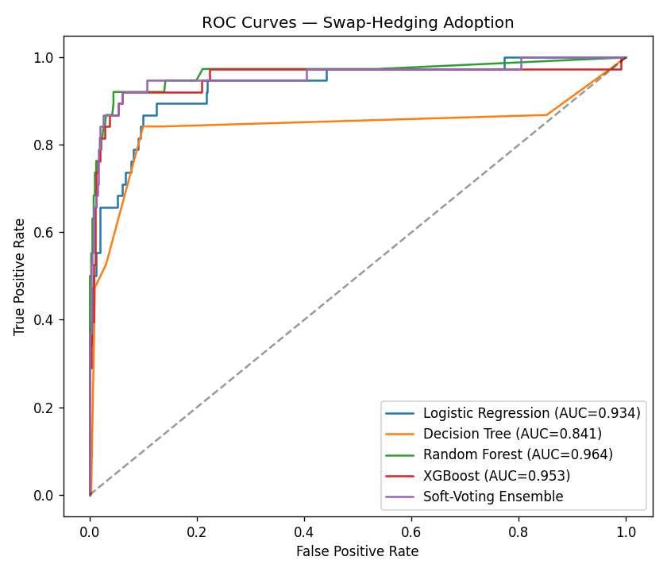
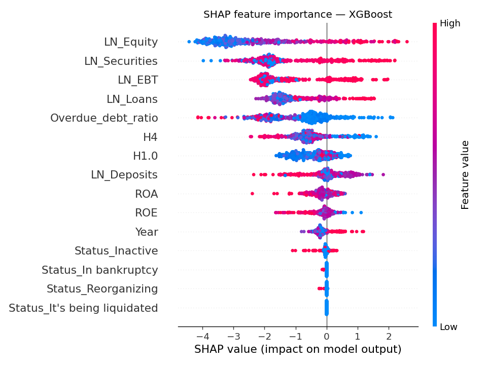

# Predicting Swap-Hedging Adoption in Russian Banks 🏦

**A machine-learning study of which financial indicators drive a bank's decision to hedge interest-rate risk with swaps - on a real 6-year panel of 529 Russian banks (2016–2021).**

  
 [](LICENSE)

---

## 💼 Business problem

Interest-rate swaps are a core tool banks use to manage interest-rate risk. Whether a bank *adopts* swap-hedging is a signal of its risk posture, sophistication, and financial health information valuable to **regulators** (monitoring systemic vulnerability) and **risk managers** (benchmarking peers). This project asks:

> **Which balance-sheet and profitability indicators most strongly predict whether a bank uses swap-hedging and can a machine-learning model forecast that decision reliably despite the rarity of hedging banks?**

## 📊 Dataset

| | |
|---|---|
| **Source** | *Financial indicators of Russian banks 2016–2021* — Mikhail Mevliutov, [Mendeley Data, DOI 10.17632/8xwbh5jxkf.1](https://data.mendeley.com/datasets/8xwbh5jxkf/1) (form 0409102 / SPARK-Interfax) |
| **Shape** | 2,354 bank-year observations · 529 unique banks · 15 variables |
| **Target** | `Hedge_indicator` (1 = adopted swap-hedging, 0 = did not) |
| **Class balance** | **~8% positive** — strongly imbalanced |
| **Features** | Log-transformed balance-sheet measures (`LN_Loans`, `LN_Securities`, `LN_Deposits`, `LN_Equity`, `LN_EBT`), ratios (`ROA`, `ROE`, `H1.0`, `H4`, `Overdue_debt_ratio`), `Year`, and bank `Status` |

The raw CSV is bundled in [`data/`](data/) so the project is fully self-contained and reproducible.

## 🔬 Methodology

A full-cycle supervised-learning workflow:

1. **Cleaning** — transliterated Cyrillic bank names to Latin (`transliterate`), parsed percent-formatted ratio strings to floats, typed `Status` as categorical.
2. **EDA** — univariate (distributions, outliers), bivariate (numeric↔target, status↔target), and a correlation heatmap. Hedging banks skew toward larger loans/securities/deposits and stronger earnings.
3. **Missing values** — median imputation for low-missingness columns and **KNN imputation** for `H4` (~15% missing).
4. **Feature selection** — forward **Sequential Feature Selection** (mlxtend) → a compact, interpretable feature set led by `LN_Loans`, `LN_Securities`, `Year`, `ROA`, `Overdue_debt_ratio`, `Status_Reorganizing`.
5. **Modeling** — Logistic Regression, Decision Tree, Random Forest, **XGBoost**, a Keras feed-forward neural network, a **soft-voting ensemble**, and a custom **dynamic logistic ensemble** ([ref](https://arxiv.org/html/2411.18649v1)), all tuned with `GridSearchCV`.
6. **Imbalance handling** — cost-sensitive learning via `class_weight='balanced'` and XGBoost `scale_pos_weight` (≈11.5) so the minority "hedge" class is not ignored.
7. **Evaluation** — accuracy, precision, recall, F1, and **ROC-AUC** on a held-out stratified test set, plus confusion matrices and **SHAP** interpretation.

## 📈 Results

Test-set performance from the reproducible comparison pipeline ([`src/model_comparison.py`](src/model_comparison.py), imbalance-aware):

| Model | Accuracy | Precision | Recall | F1 | ROC-AUC |
|---|---|---|---|---|---|
| **Random Forest** | 0.962 | **0.955** | 0.553 | 0.700 | **0.964** |
| **Soft-Voting Ensemble** | **0.968** | 0.795 | 0.816 | **0.805** | 0.958 |
| XGBoost | 0.968 | 0.848 | 0.737 | 0.789 | 0.953 |
| Logistic Regression | 0.824 | 0.301 | 0.895 | 0.450 | 0.934 |
| Decision Tree | 0.887 | 0.405 | 0.842 | 0.547 | 0.841 |

<p align="center">
  
  
</p>

**Key findings**
- Tree ensembles reach **ROC-AUC ≈ 0.95–0.96** on an 8%-positive problem. The **soft-voting ensemble** gives the best precision/recall balance (Accuracy 0.968, F1 0.805, recall 0.82), while **Random Forest** is the most precise (0.955).
- **Larger, better-capitalized, more profitable banks** are far more likely to hedge: `LN_Loans`, `LN_Securities`, `LN_Deposits` and `LN_EBT` are the dominant SHAP drivers; distressed/bankrupt banks essentially never hedge.
- Cost-sensitive weighting was essential — without it the minority class collapses (Logistic Regression trades precision for recall, F1 ≈ 0.45).

## ▶️ How to run

```bash
python -m venv .venv && .venv\Scripts\activate     # Windows ( source .venv/bin/activate on macOS/Linux )
pip install -r requirements.txt

# 1) Full analysis notebook (EDA → models → ensembles)
jupyter lab notebooks/swap_hedging_adoption.ipynb

# 2) Reproducible model comparison + figures (writes to reports/)
python src/model_comparison.py
```

## 🗂️ Repository structure
```
banking-swap-hedging-ml/
├── data/Mevliutov_Data.csv            # bundled dataset (2,354 × 15)
├── notebooks/swap_hedging_adoption.ipynb   # full EDA + modeling narrative (runs end-to-end)
├── src/model_comparison.py            # reproducible, imbalance-aware model comparison
├── reports/
│   ├── model_comparison.md            # generated metrics table
│   └── figures/                       # ROC, confusion matrix, SHAP summary
├── requirements.txt
└── README.md
```

## 🛠️ Tech stack
`Python` · `pandas` · `NumPy` · `scikit-learn` · `XGBoost` · `TensorFlow/Keras` · `mlxtend` · `SHAP` · `Matplotlib` · `Seaborn`

## 🚀 Future improvements
- Panel-aware validation (group splits by bank/year) to test temporal generalization.
- Probability calibration + threshold tuning for a target recall the regulator cares about.
- Compare cost-sensitive learning against SMOTE/oversampling head-to-head.

---

*Academic project (DAV 6150 Final Project, M.S. Data Analytics & Visualization). Dataset is public; please cite the Mendeley DOI above. Original team analysis extended here with a modular comparison pipeline, imbalance-aware modeling, and SHAP interpretation.*
